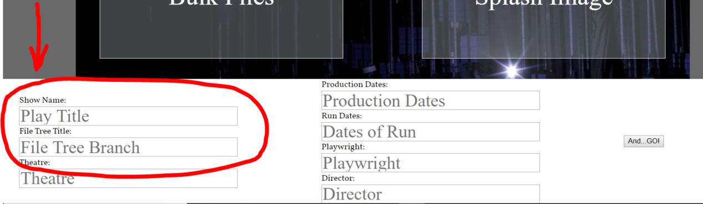
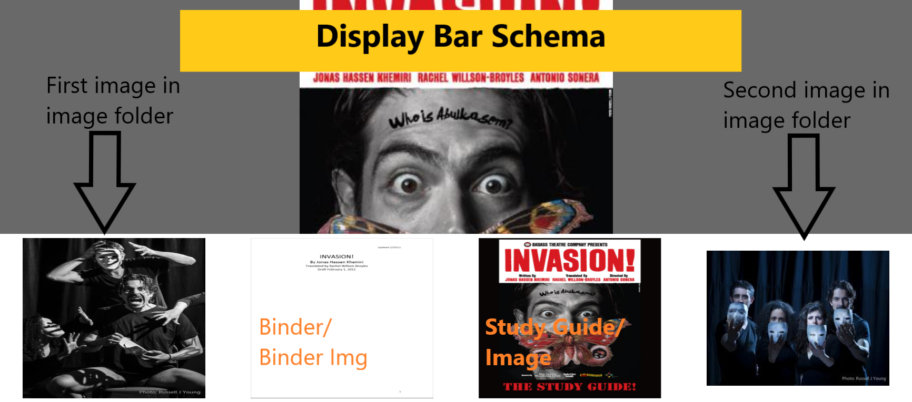

### Ghostlight DTG site
***

#### A website designed in Python and Django MVC framework.

Designed as a professional/portfolio website for my work as a dramaturge. Main page is composed of parallaxing divs. Each has a main splash image and a display bar with images and clickable links to interactive dramaturgy binders for that show and, where available, a study guide created for that show. But the frame work is easily re-configurable to any similar purpose. Currently in MVP status with more features to come. 

#### Current Features:
***
* Auto Populating Html
* Parallax Scrolling
* Drag and drop file sorting

#### Planned Features
***
* better CSS!
* user auth
* better exception handeling

#### Setup
***
* install Django. <https://docs.djangoproject.com/en/2.0/topics/install/>
* [clone repo from git](https://github.com/LeeMellon/capStone.git) 
* navigate in terminal to top of destination directory 
* run the following commands:

   **python manage.py makemigrations** (makes migrations based on current models)
   **python manage.py migrate** (updates/constructs sql database)  
   **python manage.py createsuperuser** (creates a Django Admin super-user. follow prompts in teminal)  
   **python manage.py runserver**  (launches the server)

* in **capstone/ghostlight/settings.py**  find ALLOWED_HOSTS and add the server address if it's not already present.

##### Maker Page
***

##### Drag-and Drop:
1. From the main page navigate the browser to /maker. 
2. Scroll to the bottom of the page and fill out the form. You are required to fill in the Play Title, and File Tree Branch fields at least as they are required for the model to be created and where to be saved in the database/file tree.

3. You must include:
   * A splash image  
   * A "Binder" and binder image 
   * A "Study Guide" and image
   * By "must include" I mean that **something** must go in those boxes.  

4.  To change bulk file sorting criteria go to Core/views.py lines 40-49 and ad or ammend desired file extensions or destinations.

##### Example Video
***

##### Known Bugs
***
Maker page functionality didn't work with earlier versions of Firefox.
Currently experiencing difficulties with deployment. Running into db errors. This most likely due to my lack of dev-ops skills.

##### Contact 
***
If you have any questions please contact me at <iangoodrich@hotmail.com>
or via my [Linked in profile](https://www.linkedin.com/in/ian-goodrich)

##### License
***
MIT License   
Copyright 2017    
by Ian Goodrich

Permission is hereby granted, free of charge, to any person obtaining a copy of this software and associated documentation files (the "Software"), to deal in the Software without restriction, including without limitation the rights to use, copy, modify, merge, publish, distribute, sublicense, and/or sell copies of the Software, and to permit persons to whom the Software is furnished to do so, subject to the following conditions:

The above copyright notice and this permission notice shall be included in all copies or substantial portions of the Software.

THE SOFTWARE IS PROVIDED "AS IS", WITHOUT WARRANTY OF ANY KIND, EXPRESS OR IMPLIED, INCLUDING BUT NOT LIMITED TO THE WARRANTIES OF MERCHANTABILITY, FITNESS FOR A PARTICULAR PURPOSE AND NONINFRINGEMENT. IN NO EVENT SHALL THE AUTHORS OR COPYRIGHT HOLDERS BE LIABLE FOR ANY CLAIM, DAMAGES OR OTHER LIABILITY, WHETHER IN AN ACTION OF CONTRACT, TORT OR OTHERWISE, ARISING FROM, OUT OF OR IN CONNECTION WITH THE SOFTWARE OR THE USE OR OTHER DEALINGS IN THE SOFTWARE.